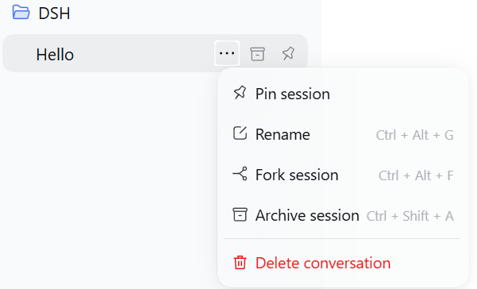
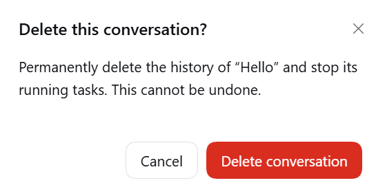
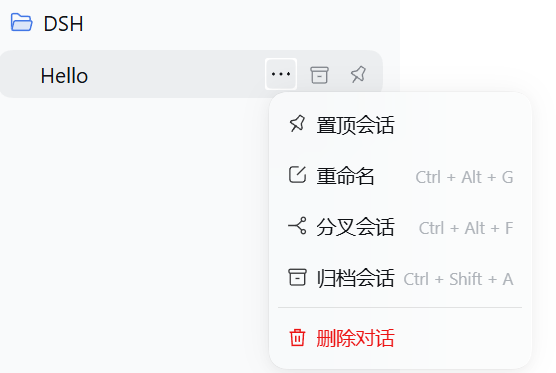

# dsh-desktop-delete

[简体中文](README.zh-CN.md)

A small community plugin that adds **Delete conversation** to the DeepSeek Harness desktop session menu. Includes a native confirmation dialog and Chinese/English labels.

**Version:** 0.1.1 · **Tested Harness:** 0.2.0-rc.2 · **License:** MIT

## Screenshots

These four screenshots were provided from the installed desktop application, using a conversation titled “Hello”. They show the menu and confirmation dialog; deletion persistence is covered separately in [VALIDATION.md](VALIDATION.md).

| English menu | English confirmation |
| --- | --- |
|  |  |

| 中文菜单 | 中文确认框 |
| --- | --- |
|  |  |

## Install on Windows

1. Download **dsh-desktop-delete-0.1.1-windows.zip** from [Releases](https://github.com/martin2026US-lab/dsh-desktop-delete/releases/latest) and extract it.
2. Fully quit Harness using **Exit** in the system tray. Closing its window leaves the background process running.
3. Run the following in PowerShell 7, replacing the directory with the extracted folder:

~~~powershell
& 'C:\Program Files\PowerShell\7\pwsh.exe' -NoLogo -NoProfile -File '<extracted-folder>\Install.ps1'
~~~

The ZIP keeps Install.ps1 and dsh-desktop-delete-0.1.1.tgz together. Add **-ApplicationPath** with the path to DeepSeek Harness.exe for a custom location, or **-CheckOnly** to check compatibility without installing. The script uses the desktop application's bundled command runtime; you do not need a separate Node.js/npm installation for installation.

4. Reopen Harness. Choose **Delete conversation** in the three-dot menu and confirm.

For manual installation, use the **desktop-bundled** dsh command, with Harness fully exited:

~~~powershell
dsh plugin --profile desktop add '<full-path>\dsh-desktop-delete-0.1.1.tgz'
~~~

To uninstall, fully quit Harness and use the same bundled command:

~~~powershell
dsh plugin --profile desktop remove dsh-desktop-delete
~~~

A separately installed npm CLI cannot substitute for the Electron-managed desktop profile. See the [official desktop command-runtime documentation](https://github.com/deepseek-ai/deepseek-harness/blob/master/apps/desktop/README.md#bundled-command-runtime).

## What deletion does

- Uses native menu/overlay slots and the selected Session ID.
- Checks Harness request admission, requires explicit confirmation, and merges simultaneous requests for the same ID.
- Archives the target to stop its activity, waits for idle, flushes and closes its exact writer, then removes its managed JSONL directory and sidebar membership/pin/archive entries.
- Acquires the native exclusive write lease for cold conversations. Historical JSONL records are migrated by Harness under that lease before deletion, so opening an old conversation manually is unnecessary.
- Detaches the selected live Agent and Session after maintenance, preventing the in-memory catalog from restoring a deleted conversation.
- Attempts to restore the directory, sidebar state and writer if deletion fails. Stopped tasks are not restarted automatically.

Deletion is permanent. Workspace files, other conversations and shared attachments are outside its scope. This feature does not erase copies in backups, diagnostic logs or general caches.

## Compatibility

Validated against the official **Harness desktop 0.2.0-rc.2** Windows build. This version has no public close-one-session API, so the plugin checks and uses version-specific lifecycle/writer internals. The Harness engine is pinned; revalidation is required before using a different release. Refused operations display an error and preserve the conversation whenever rollback succeeds.

## Development and tests

Node.js 24 or newer; no external npm dependencies.

~~~sh
npm run verify
npm pack
~~~

The twelve standalone tests run in GitHub Actions on Windows and Linux. Eight optional tests exercise real Harness runtime services; see [integration setup](test/integration/README.md). Both suites passed locally, **20/20**. [VALIDATION.md](VALIDATION.md) distinguishes native-runtime, fixture-UI and installed-app evidence.

## Credits

Based on the deletion lifecycle ideas in [martin2026US-lab/dsh-session-organizer](https://github.com/martin2026US-lab/dsh-session-organizer): stop activity, flush/close the writer, quarantine the directory and attempt rollback. This plugin adds desktop-native menu integration and precise lifecycle cleanup.

Unofficial community extension, released under [MIT](LICENSE).
